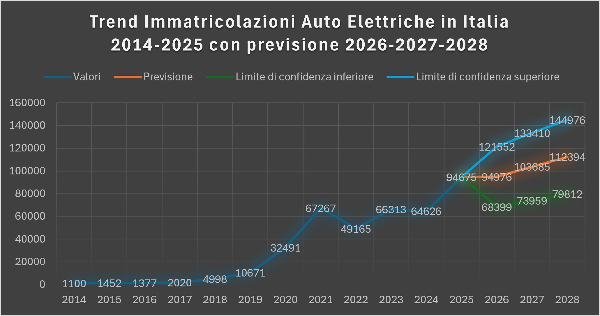
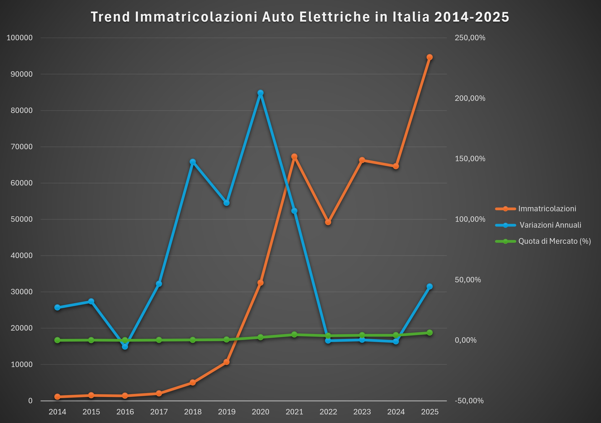

Analisi e Previsione Mercato Auto Elettriche (Italia 2014-2028)

Descrizione: Questo progetto contiene un'analisi dell'andamento delle immatricolazioni di auto elettriche in Italia dal 2014 al 2025, basata su dati ufficiali UNRAE.

Obiettivi:

Pulizia dati: Strutturazione di dati grezzi per l'analisi.

Analisi trend: Identificazione della crescita del settore nel tempo.

Visualizzazione: Creazione di Pivot Chart con asse secondario per confrontare volumi assoluti e quote di mercato.

Strumenti utilizzati:

Microsoft Excel: Gestione dati, Pivot Table, Data Cleaning, Data Visualization.

Aggiornamento: 

Analisi Predittiva (2026-2028)
Il progetto è stato arricchito con una sezione di analisi predittiva per il triennio 2026-2028:

Proiezione statistica: Utilizzo di modelli di regressione per stimare l'andamento futuro basato sullo storico 2014-2025.

Analisi dei margini: 

Il nuovo grafico include limiti di confidenza (scenario ottimistico e pessimistico) per contestualizzare la variabilità e l'incertezza intrinseca del mercato.

Dataset integrato: 

Il file Excel è stato aggiornato con un foglio dedicato ai calcoli previsionali, rendendo l'intero modello trasparente e verificabile.

Anteprima dei grafici:

.

Licenza:
Questo progetto è rilasciato sotto licenza MIT.
